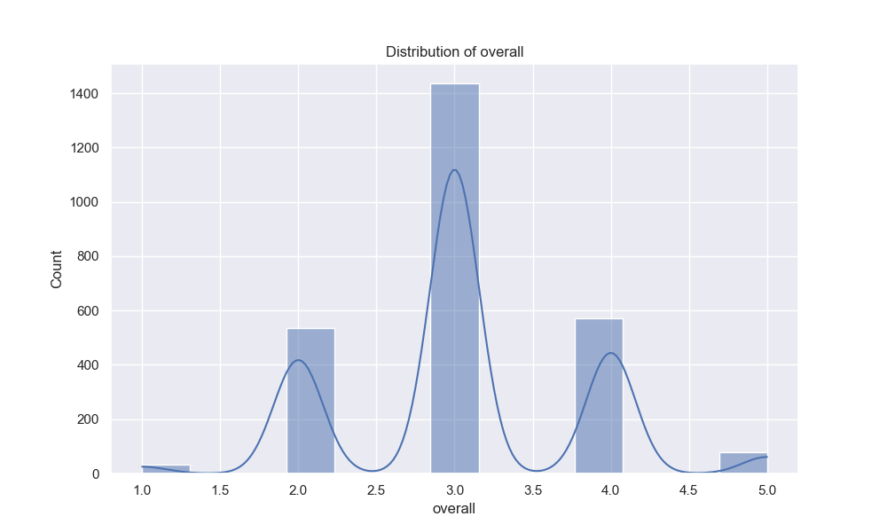
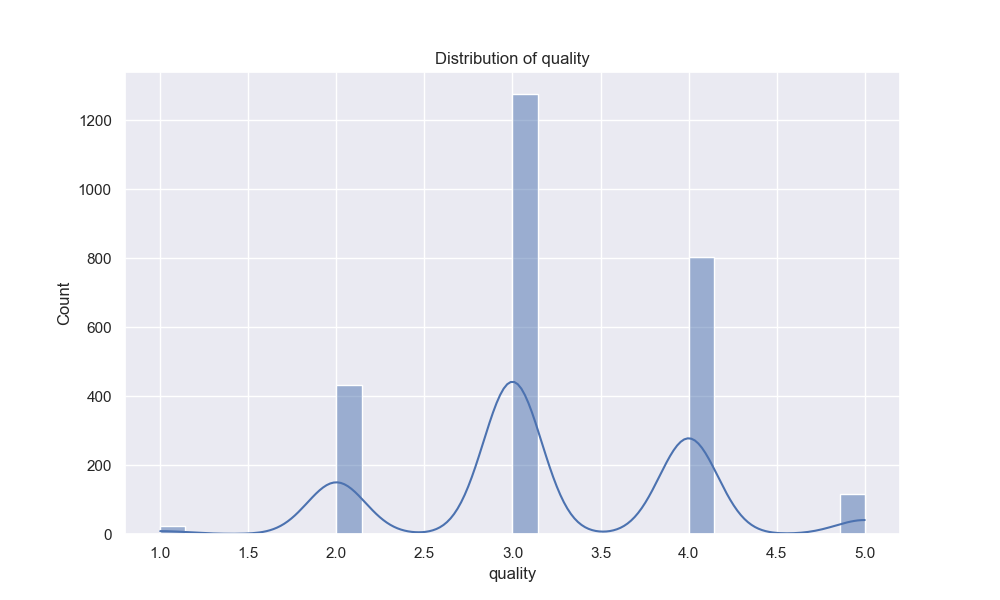
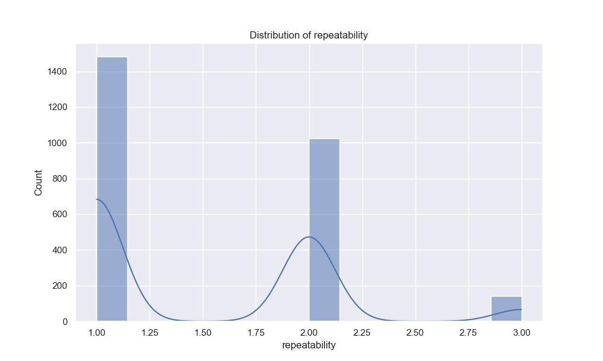
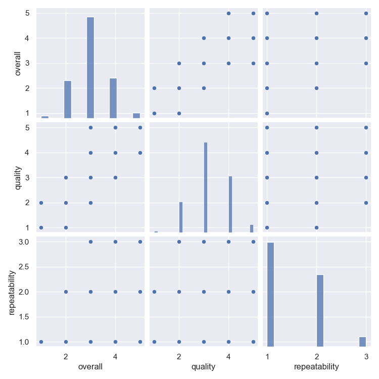
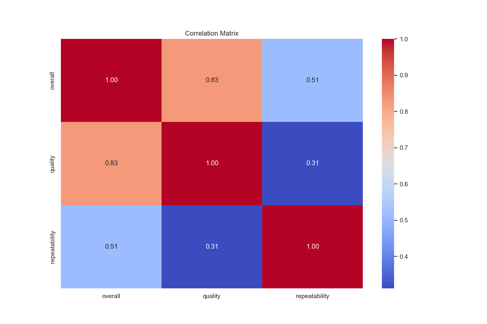

# Automated Data Analysis Report

## Analysis Summary

### Dataset Overview
Number of rows: 2652
Number of columns: 8

### Column Information
- date (object)
- language (object)
- type (object)
- title (object)
- by (object)
- overall (int64)
- quality (int64)
- repeatability (int64)

### Missing Values
- date: 99 missing values
- language: 0 missing values
- type: 0 missing values
- title: 0 missing values
- by: 262 missing values
- overall: 0 missing values
- quality: 0 missing values
- repeatability: 0 missing values

### Summary Statistics
#### date
- count: 2553
- unique: 2055
- top: 21-May-06
- freq: 8
- mean: nan
- std: nan
- min: nan
- 25%: nan
- 50%: nan
- 75%: nan
- max: nan

#### language
- count: 2652
- unique: 11
- top: English
- freq: 1306
- mean: nan
- std: nan
- min: nan
- 25%: nan
- 50%: nan
- 75%: nan
- max: nan

#### type
- count: 2652
- unique: 8
- top: movie
- freq: 2211
- mean: nan
- std: nan
- min: nan
- 25%: nan
- 50%: nan
- 75%: nan
- max: nan

#### title
- count: 2652
- unique: 2312
- top: Kanda Naal Mudhal
- freq: 9
- mean: nan
- std: nan
- min: nan
- 25%: nan
- 50%: nan
- 75%: nan
- max: nan

#### by
- count: 2390
- unique: 1528
- top: Kiefer Sutherland
- freq: 48
- mean: nan
- std: nan
- min: nan
- 25%: nan
- 50%: nan
- 75%: nan
- max: nan

#### overall
- count: 2652.0
- unique: nan
- top: nan
- freq: nan
- mean: 3.0475113122171944
- std: 0.7621797580962717
- min: 1.0
- 25%: 3.0
- 50%: 3.0
- 75%: 3.0
- max: 5.0

#### quality
- count: 2652.0
- unique: nan
- top: nan
- freq: nan
- mean: 3.2092760180995477
- std: 0.7967426636666686
- min: 1.0
- 25%: 3.0
- 50%: 3.0
- 75%: 4.0
- max: 5.0

#### repeatability
- count: 2652.0
- unique: nan
- top: nan
- freq: nan
- mean: 1.4947209653092006
- std: 0.598289430580212
- min: 1.0
- 25%: 1.0
- 50%: 1.0
- 75%: 2.0
- max: 3.0

## Analysis Story

Failed to query LLM: Error querying LLM: 401 {
  "message": "Bearer None is invalid: JWSInvalid: Invalid Compact JWS"
}
## Visualizations

